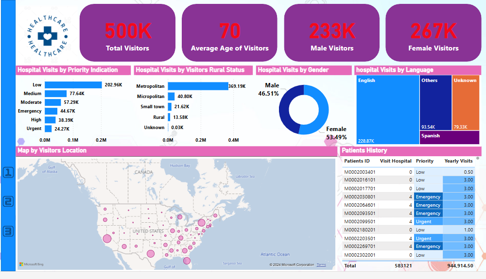

# Healthcare Dashboard Insights

This dashboard provides an overview of key metrics related to hospital visits, visitor demographics, priority levels, and language preferences.

## 📊 Key Metrics
- **Total Visitors**: 500K
- **Average Age of Visitors**: 70
- **Male Visitors**: 233K
- **Female Visitors**: 267K

## 🏥 Hospital Visits by Priority Indication
- **Low Priority**: 202.96K visits
- **Medium Priority**: 77.64K visits
- **Moderate Priority**: 57.29K visits
- **Emergency**: 44.67K visits
- **High Priority**: 38.39K visits
- **Urgent Priority**: 24.27K visits

## 🌍 Hospital Visits by Visitors' Rural Status
- **Metropolitan**: 369.19K visits
- **Micropolitan**: 40.80K visits
- **Small Town**: 21.62K visits
- **Rural**: 13.58K visits
- **Unknown**: 0.03K visits

## 📊 Hospital Visits by Gender
- **Male**: 46.51%
- **Female**: 53.49%

## 🌐 Hospital Visits by Language
- **English**: 228.87K visits
- **Spanish**: 93.54K visits
- **Others**: Not specified
- **Unknown**: 79.33K visits

## 🗺️ Map by Visitors Location
A map shows visitor distribution across different locations within the United States, with higher concentrations in certain regions.

## 📋 Patient History (Sample Data)
- Includes individual patient IDs, visit priorities, and yearly costs.
- Total Visits: 583,121
- Total Yearly Costs: $944,914.50

## 🔍 Insights
1. **Visitor Demographics**: There is a nearly balanced gender distribution with a slight female majority (53.49%).
2. **Language Preferences**: English is the dominant language among visitors, followed by Spanish.
3. **Priority Levels**: Most visits are low-priority, while a smaller portion are urgent or emergency cases, highlighting potential areas for resource allocation.
4. **Visitor Locations**: A large majority of visitors come from metropolitan areas.

## 🚀 Suggested Actions
1. **Language Services**: Consider expanding support for Spanish-speaking visitors to enhance patient experience.
2. **Emergency Preparedness**: While most visits are low-priority, ensure that emergency services are well-staffed for urgent cases.
3. **Resource Allocation**: Focus resources in metropolitan areas due to the high volume of visitors from these locations.

# Author : Md Sobahan Mia

# for source code
send me a email iamsobahan@gmail.com
